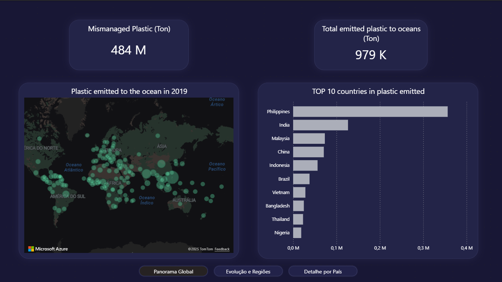
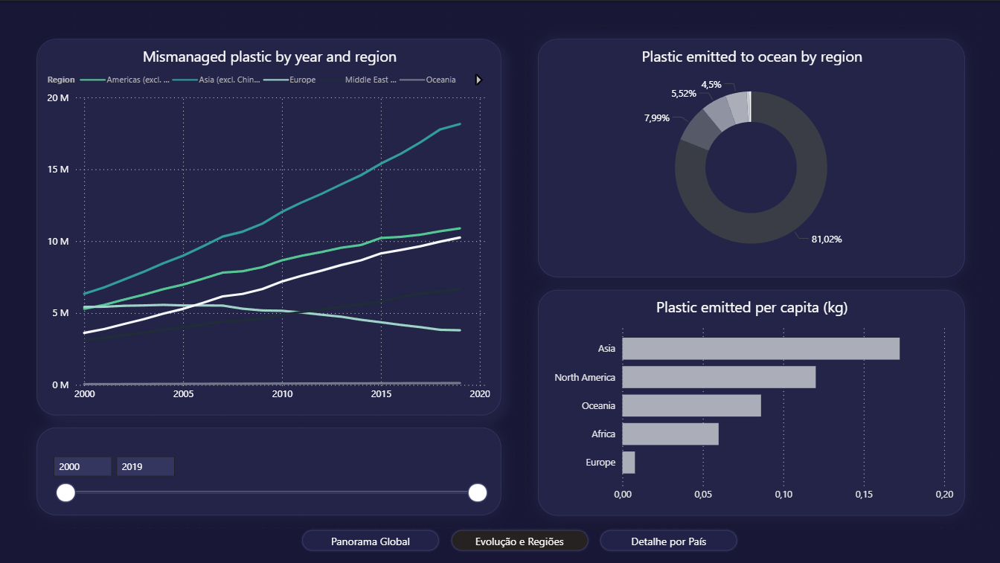
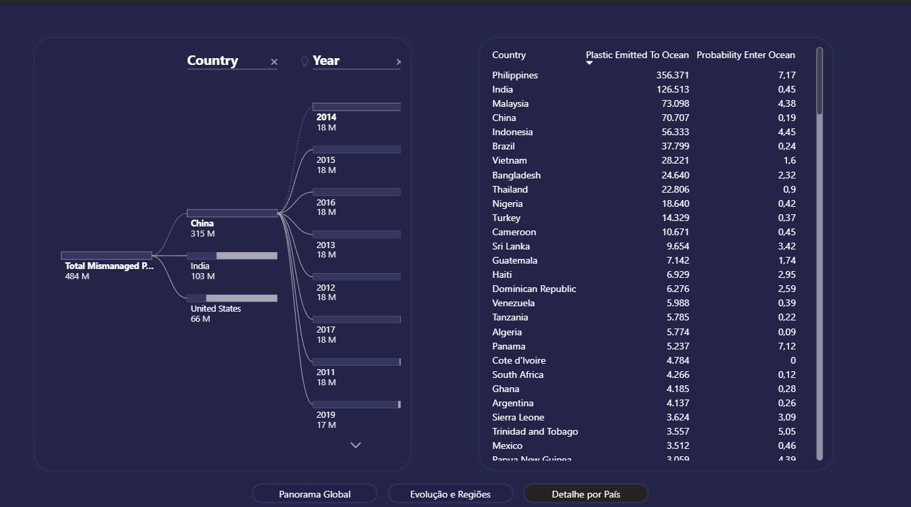

# Plastic Litter Explorer (PLE)

**Unidade Curricular:** Análise, Comunicação e Visualização da Informação  
**Instituição:** Instituto Politécnico da Guarda

## Autores

*   **Kevin Silva** (1710525) - [kevinasilva07@gmail.com](mailto:kevinasilva07@gmail.com)
*   **Gabriel Pinho** (171051) - [gabrielbritopinho@gmail.com](mailto:gabrielbritopinho@gmail.com)

**Repositório:** [https://github.com/k3vin35/ple-kg](https://github.com/k3vin35/ple-kg)

## Índice

1.  [Descrição do Trabalho](#1-descrição-do-trabalho)
2.  [Arquitetura da Solução](#arquitetura-da-solução)
3.  [Implementação](#2-implementação-do-trabalho)
4.  [Funcionamento do Dashboard](#3-funcionamento-do-trabalho)
5.  [Conclusão](#4-conclusão)
6.  [Bibliografia](#bibliografia)

## 1. Descrição do Trabalho

Este trabalho, realizado no âmbito da disciplina de Análise, Comunicação e Visualização da Informação, teve como objetivo resolver o problema: **Falta de visão integrada da poluição plástica**.

O objetivo principal foi desenvolver uma solução que agregasse estes dados num **Dashboard interativo**, permitindo uma análise temporal e geográfica. O sistema processa dados brutos sobre emissões, probabilidade de entrada no oceano e gestão de resíduos, transformando-os em visualizações que apoiam a tomada de decisão.

### Arquitetura da Solução

A solução segue a seguinte estrutura:

*   **Fontes de Dados:** Datasets CSV provenientes do *Our World in Data* e do *EMODnet*.
*   **Pré-Processamento (Python):** Scripts em Python (biblioteca Pandas) para limpeza, normalização de nomes de países e fusão (*merge*) de tabelas dispersas.
*   **Armazenamento:** Criação de dois datasets: `owid_plastic_countries.csv` e `owid_plastic_final.csv`.
*   **Visualização (Power BI):** Importação dos dados, modelação e criação de dashboards interativos.
*   **Apresentação (Web):** Incorporação do dashboard numa página Google Sites.

## 2. Implementação do Trabalho

A implementação do trabalho foi realizada em duas etapas:

### Pré-processamento com Python
Utilizou-se a linguagem Python para juntar os dados que iam ser usados todos no mesmo dataset. Foi criado um script que unificou estes ficheiros com base nas chaves `Country` e `Year`.

Separaram-se os dados em duas tabelas para evitar duplicação de valores no Power BI: uma para análise por país e outra para análise por regiões.

### Desenvolvimento no Power BI
No Power BI Desktop, procedeu-se à modelação dos dados e construção da interface gráfica:

*   **Tratamento de Dados:** Correção de tipos de dados e formatação regional.
*   **UX/UI:** Criação de um layout escuro. Implementou-se um sistema de navegação por botões para simular uma experiência de aplicação web.
*   **Visualizações:** Utilização de mapas de bolhas, gráficos de linhas, árvores de decomposição, histogramas, etc.

## 3. Funcionamento do Trabalho

O dashboard final é composto por três painéis principais de análise:

### 1. Panorama Global
Nesta página oferecemos uma visão imediata da poluição em 2019. O mapa central permite identificar geograficamente os maiores emissores, enquanto os KPIs no topo quantificam o volume total de plástico no oceano (aprox. 979 mil toneladas) e o volume de lixo mal gerido.
O gráfico de barras lateral destaca o "Top 10" países, evidenciando o papel preponderante de nações asiáticas (Filipinas, Índia, Malásia) nas emissões marinhas.

### 2. Evolução e Regiões
Nesta secção, analisa-se a componente temporal (2000-2019). O gráfico de linhas demonstra que regiões desenvolvidas estabilizaram a má gestão de resíduos, enquanto regiões em desenvolvimento apresentam um crescimento exponencial.
O gráfico de rosca (Donut) complementa a análise mostrando a quota de responsabilidade de cada continente nas emissões oceânicas.

### 3. Detalhe por País
Utilizando uma Árvore de Decomposição, o utilizador pode explorar os dados em profundidade, isolando um país específico para ver o seu histórico ou comparando valores exatos através de uma tabela detalhada. Esta página permite validar a correlação entre a probabilidade de entrada no oceano e o lixo mal gerido.

## 4. Conclusão

Este trabalho permitiu cumprir com sucesso o objetivo de criar uma visão integrada sobre a poluição plástica. Através do dashboard desenvolvido, foi possível transformar dados brutos e dispersos em informação visual clara, permitindo concluir que a crise dos plásticos é geograficamente desigual e tem vindo a agravar-se significativamente nas últimas duas décadas em regiões específicas.

**O que se fez:**
*   ✅ Integração bem-sucedida de dados de emissão, gestão e risco.
*   ✅ Criação de uma interface navegável e intuitiva integrada num website.
*   ✅ Identificação visual clara dos focos de poluição (Ásia) e tendências temporais.

**O que faltou fazer (Limitações):**
*   **Histórico Global:** Apenas grandes economias (EUA, China, Índia) possuem registros históricos detalhados de má gestão de resíduos, limitando a análise temporal para outros países.
*   **Sensores de Microplásticos:** Devido à inexistência de um dataset global público com contagens reais de microplásticos em tempo real, utilizou-se uma estimativa baseada na massa de plástico emitida. Uma melhoria futura seria integrar APIs de sensores oceanográficos reais (como bóias inteligentes).

---

## 📚 Bibliografia

1.  [Microsoft Power BI Documentation](https://learn.microsoft.com/en-us/power-bi/)
2.  [EMODnet - Human Activities](https://emodnet.ec.europa.eu/en/human-activities)
3.  [Our World in Data - Plastic Pollution](https://ourworldindata.org/plastic-pollution)
4.  [Google AI Studio](https://aistudio.google.com/)

